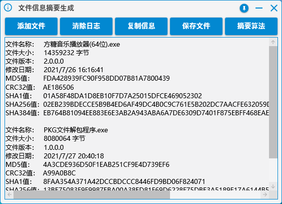
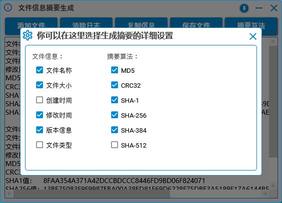

# Information-summary

#### 文件信息摘要生成器

## 介绍

软件用于生成文件信息摘要，文件信息支持读取，名称、大小、创建日期、修改日期、软件版本、文件类型

摘要算法方面支持MD5、CRC32、SHA1、SHA256、SHA284、SHA512

支持多选文件，窗体拖入文件，复制信息，保存为文件等等

软件摘要信息获取全部在后台执行，不会造成前台UI控件的卡顿

## 截图

## 最后

编译好的文件链接：

蓝奏云：https://wwe.lanzoui.com/b01oha7uf 密码:9d7r

百度云：https://pan.baidu.com/s/1TT8k5Pw3WITv0o0vVjZ0AQ 提取码:qsen 

缺点：如果对一个被占用的文件进行摘要生成会造成卡进度条，以后会想解决方案去解决它
